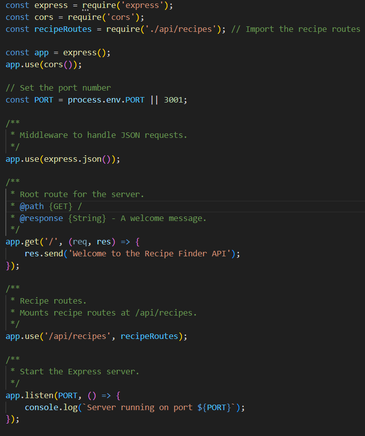

# Recipe Finder App Backend

This is the backend service for the Recipe Finder App, a web application for searching and viewing various recipes. It's built using Node.js and Express, and integrates with external recipe APIs.


## Table of Contents

- [Recipe Finder App Backend](#recipe-finder-app-backend)
  - [Table of Contents](#table-of-contents)
  - [Introduction](#introduction)
  - [Features](#features)
  - [Installation](#installation)
  - [Usage](#usage)
  - [Contributing](#contributing)
  - [License](#license)


## Introduction

The backend of the Recipe Finder App handles requests from the frontend, interacts with external recipe APIs, and delivers recipe data to users. It's designed for efficiency and reliability, ensuring fast and accurate recipe searches.




## Features

The backend service offers the following features:

- **Recipe Search**: Allows users to search for recipes by name, ingredients, or randomly.
- **Recipe Details**: Provides detailed information about recipes, including ingredients, instructions, and nutritional facts.
- **API Integration**: Seamlessly integrates with external recipe APIs for a diverse range of recipes.
- **Scalability**: Designed to efficiently handle a large number of requests.

## Installation

To set up the backend service on your local machine:

1. Clone the repository:

   ```bash
   git clone https://github.com/blockchaincyberpunk1/recipe-finder-app-server.git
   ```

2. Navigate to the server directory:

   ```bash
   cd recipe-finder-app-server/server
   ```

3. Install the required dependencies:

   ```bash
   npm install
   ```

4. Start the server:

   ```bash
   npm start
   ```

## Usage

Once the server is running, it will handle API requests from the Recipe Finder App frontend. The server can also be integrated with other frontends that follow the same API contract. 

## Contributing

Contributions to the Chat App backend are welcome! If you have suggestions for improvements or encounter any issues, please feel free to open an issue or submit a pull request.  

## License

This project is open-sourced under the MIT License. See the LICENSE file for more details.

